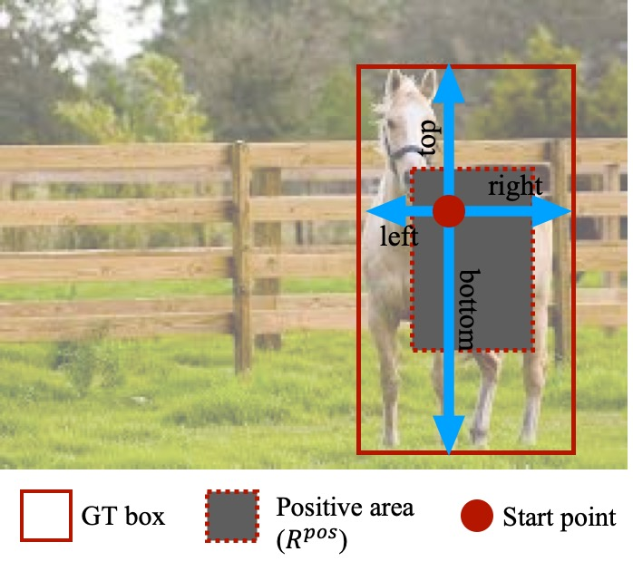

# FoveaBox: Beyond Anchor-based Object Detector

This repo is a official implementation of "FoveaBox: Beyond Anchor-based Object Detector" on COCO object detection based on open-mmlab's mmdetection. Many thanks to mmdetection for their simple and clean framework.

## News
FoveaBox is supported by the official mmdetection repo [here](https://github.com/open-mmlab/mmdetection/tree/master/configs/foveabox). Thanks again for open-mmlab's work on open source projects.

## Introduction
FoveaBox is an accurate, flexible and completely anchor-free object detection system for object detection framework, as presented in our paper [https://arxiv.org/abs/1904.03797](https://arxiv.org/abs/1904.03797):
Different from previous anchor-based methods, FoveaBox directly learns the object existing possibility and the bounding box coordinates without anchor reference. This is achieved by: (a) predicting category-sensitive semantic maps for the object existing possibility, and (b) producing category-agnostic bounding box for each position that potentially contains an object.

<div align="center">
  
  <p>FoveaBox detection process.</p>
</div>


## Installation 
This FoveaBox implementation is based on [mmdetection](https://github.com/open-mmlab/mmdetection). Therefore the installation is the same as original mmdetection.

Please check [INSTALL.md](INSTALL.md) for installation instructions.


## Train and inference
The FoveaBox config is in [configs/foveabox](configs/foveabox).

### Inference
    # single-gpu testing
    python tools/test.py ${CONFIG_FILE} ${CHECKPOINT_FILE} [--out ${RESULT_FILE}] --eval bbox [--show]
    
    # multi-gpu testing
    ./tools/dist_test.sh ${CONFIG_FILE} ${CHECKPOINT_FILE} ${GPU_NUM} [--out ${RESULT_FILE}] --eval bbox

### Training
    # single-gpu training
    python tools/train.py ${CONFIG_FILE}
    
    # multi-gpu training
    ./tools/dist_train.sh ${CONFIG_FILE} ${GPU_NUM} [optional arguments]
    
Please check [GETTING_STARTED.md](GETTING_STARTED.md) for detailed instructions.


## Main Results
### Results on R50/101-FPN with backbone 

| Backbone  | Style   |  align  | ms-train| Lr schd | Mem (GB) | Train time (s/iter) | Inf time (fps) | box AP | Download |
|:---------:|:-------:|:-------:|:-------:|:-------:|:--------:|:-------------------:|:--------------:|:------:|:--------:|
| R-50      | pytorch | N       | N       | 1x      | 5.7      | 0.450               | 13.5           | 36.5   | [model](https://drive.google.com/file/d/19eQNnctoC1VTcP2AKdCryQGjb6Dzq62r/view?usp=sharing) |
| R-50      | pytorch | N       | N       | 2x      | -        | -                   |                | 36.9   | [model](https://drive.google.com/file/d/1W-9DrNQcaw4vaLLON8GLe86pfBXztbWR/view?usp=sharing) |
| R-50      | pytorch | Y       | N       | 2x      | -        | -                   |                | 37.9   | [model](https://drive.google.com/file/d/1RtTizixUDqd7X-PifTI7rseXZ1Q8YaAf/view?usp=sharing) |
| R-50      | pytorch | Y       | Y       | 2x      | -        | -                   |                | 40.1   | [model](https://drive.google.com/file/d/1bHwmP3Uy-lFUifAyzkWykZTkYY-v-nEN/view?usp=sharing) |
| R-101     | pytorch | N       | N       | 1x      | 9.4      | 0.712               | 11.5           | 38.5   | [model](https://drive.google.com/file/d/1Xb6hDUquGKB8ad7DigrF8K9sX8xoZigh/view?usp=sharing) |
| R-101     | pytorch | N       | N       | 2x      | -        | -                   | -              | 38.5   | [model](https://drive.google.com/file/d/1ToZyqAxjWIZ4N8SDL4gufmkA-Wjz_VUW/view?usp=sharing) |
| R-101     | pytorch | Y       | N       | 2x      | -        | -                   | -              | 39.4   | [model](https://drive.google.com/file/d/1n34MNGfgrMmJdpT2xAaEQOw8GJhTd1z8/view?usp=sharing) |
| R-101     | pytorch | Y       | Y       | 2x      | -        | -                   | -              | 41.9   | [model](https://drive.google.com/file/d/1ZQAsW9SxMdCTX3_pjIIHotg0yDT2wy34/view?usp=sharing) |

[1] *1x and 2x mean the model is trained for 12 and 24 epochs, respectively.* \
[2] *Align means utilizing deformable convolution to align the cls branch.* \
[3] *All results are obtained with a single model and without any test time data augmentation.*\
[4] *We use 4 NVIDIA Tesla V100 GPUs for training.*

Any pull requests or issues are welcome.

## Citations
Please consider citing our paper in your publications if the project helps your research. BibTeX reference is as follows.
```
@article{kong2019foveabox,
  title={FoveaBox: Beyond Anchor-based Object Detector},
  author={Kong, Tao and Sun, Fuchun and Liu, Huaping and Jiang, Yuning and Li, Lei and Shi, Jianbo},
  journal={IEEE Transactions on Image Processing},
  pages={7389--7398},
  year={2020}
}
```
